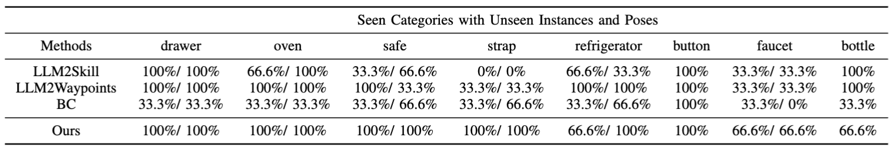

# Kinematic-aware Prompting for Generalizable Articulated Object Manipulation with LLMs

PyTorch code accompanies our paper:
__Kinematic-aware Prompting for Generalizable Articulated Object Manipulation with LLMs__

[Wenke Xia](https://xwinks.github.io/)\*, [Dong Wang](https://scholar.google.es/citations?user=dasL9V4AAAAJ&hl=zh-CN)\*, Xincheng Pang, [Zhigang Wang](https://scholar.google.com/citations?hl=zh-CN&user=cw3EaAYAAAAJ&view_op=list_works&sortby=pubdate), [Bin Zhao](https://scholar.google.com/citations?user=DQB0hqwAAAAJ&hl=zh-CN), [Di Hu](https://dtaoo.github.io/)‡

Resources:[[Project Page](https://gewu-lab.github.io/llm_for_articulated_object_manipulation/)],[[Arxiv](https://arxiv.org/abs/2311.02847)]

___


## Introduction

In this work, we delve into the problem of harnessing LLMs for generalizable articulated object manipulation, recognizing that the rich world knowledge inherent in LLMs is adept at providing a reasonable manipulation understanding of various articulated objects.

## Framework
We aim to solve generalizable articulated object manipulation problems that require kinematic and geometric reasoning of objects to generate precise manipulation policy. 

As shown in (a), we first propose the Unified Kinematic Knowledge Parser component to grasp the object's kinematic structure as a unified kinematic knowledge representation for LLMs. As demonstrated in (b), based on the unified representation, we construct a kinematic-aware hierarchical prompt, which is used in the Kinematic-aware Manipulation Planner component to guide LLMs to generate an abstract textual manipulation sequence, and a sequence of 3D manipulation waypoints for generalizable articulated object manipulation.

## Dataset
we conduct experiments in the [Isaac Gym simulator](https://developer.nvidia.com/isaac-gym), with distinct object instances across 16 types of articulated objects from the [PartNet-Mobility dataset](https://sapien.ucsd.edu/browse). The dataset can be downloaded [here](https://drive.google.com/file/d/1iWoY4jmi-1mDt8Th907zNvfh0d3E9hL9/view?usp=drive_link). 


## Install
In this work, we use [Isaac gym](https://developer.nvidia.com/isaac-gym) as the simulation environment, the [curobo](https://curobo.org/) as the motion planner. This code is tested in Ubuntu 20.04, pytorch 1.13.1+cu117, Isaac gym 2020.2.

First install the requirements:

```
pip install -r requirements.txt
```

Then install the Isaac gym and curobo according to their official documents.

## Demonstration Collection

Collect the human demonstration by running
```
python human_manipulation --task open_door --index 0
```
, the keyboard could be used to determine the next waypoint following the rule below as defined in the `subscribe_viewer_keyboard_event` function:
```
    W, "move forward"
    S, "move backward"
    A, "move left"
    D, "move right"
    Q, "move up"
    E, "move down"
    G, "grasp"
    V, "release"
    I, "exec"
    R, "reset"
    H, "move to handle pos"
    N, "record data"
    Z, "rotate_right"
    X, "rotate_left"
```
We have provided visualization for the target waypoint. Once the target waypoint is determined, user could press `N` to record the data and move the franka arm to the target waypoint. 
When the task if finished, user could press `L` to save the trajectory.

To replay the human demonstration, users could use the command below.
```
python replay_human_manipulation.py --demo_path open_drawer_19179_0
```

## Evaluation

To prompt GPT generate a reasonable trajectory, first change the openai key in `prompt_tool/agent.py`, then run

```
python gpt_manipulation.py --task open_drawer
```

We have provided part of the manipulation demonstrations in `prompt_config` and `rotate_records`. Users could also follow the format to prompt GPT with their demonstration dataset.

## Results

The result on seen object categories are:


The result on unseen object categories are:


## Citation 

```

@misc{xia2023kinematicaware,
      title={Kinematic-aware Prompting for Generalizable Articulated Object Manipulation with LLMs}, 
      author={Wenke Xia and Dong Wang and Xincheng Pang and Zhigang Wang and Bin Zhao and Di Hu},
      year={2023},
      eprint={2311.02847},
      archivePrefix={arXiv},
      primaryClass={cs.RO}
}
```
